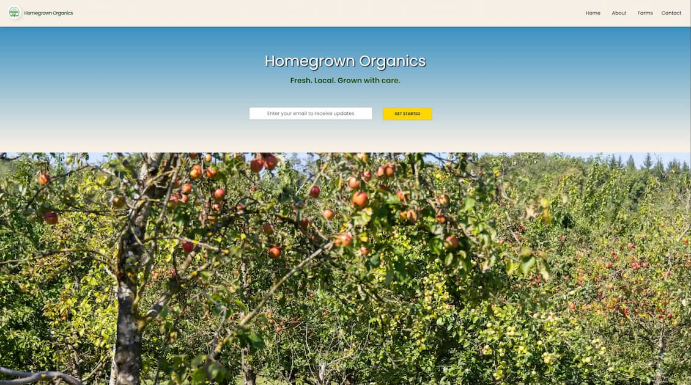

# Homegrown Organics

  

A responsive single-page landing site for a local organic food marketplace featuring Belgian farms, built with HTML5, CSS3 and vanilla JavaScript.

---

## Overview

Homegrown Organics connects consumers with local Belgian farms selling certified organic produce. This project is a static landing page built as a frontend training exercise at freeCodeCamp that I improved and personalized.

**Live Demo →** [View Site](https://thierrybwuzure.github.io/Organic-Food-Landing-Page/)

---

## Sections

- Hero with email sign-up
- About — Local · Foods · Farms pillars
- Farm showcase (Mish Mash, La Falize, La Warde)
- Product cards with pricing
- Embedded documentary video
- Contact & subscription form
- Footer

## Features

- Mobile-first responsive design (4 breakpoints: mobile, tablet, desktop, large desktop)
- CSS-based hamburger menu enhanced with JavaScript (auto-close on link click and outside click)
- Flexbox & CSS Grid layouts
- Smooth animations and hover effects
- Interactive farm image galleries
- Google Fonts (Poppins) & Font Awesome icons

---

## What I Learned

- Mobile-first design approach and media query strategy
- Combining Flexbox and Grid in the same project
- Integrating third-party libraries (Font Awesome, Google Fonts)
- Enhancing a CSS-only hamburger menu with JavaScript for better UX (event listeners, DOM manipulation)

---

## Project Structure

Organic-Food-Landing-Page/
├── index.html
├── styles.css
├── script.js
└── images/

---

## Author

**Thierry Bwuzure** — Junior Frontend Developer · Brussels, Belgium

[GitHub](https://github.com/thierrybwuzure) · [LinkedIn](https://linkedin.com/in/thierrybwuzure)
